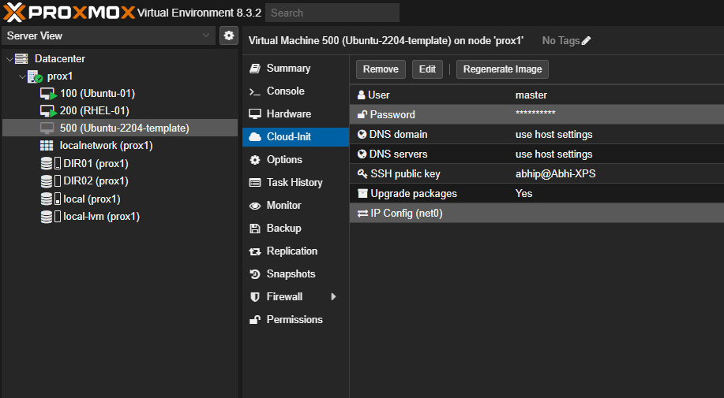

# Cloud-Init Overview

Cloud-Init is an open-source tool used to automate the initial setup of virtual machines or cloud instances during their first boot. It simplifies instance configuration and customization across various cloud platforms.

## Key Features
- **Cloud Independence**: Works across multiple cloud platforms like AWS, Azure, Google Cloud, OpenStack, and more.
- **User Data Support**: Accepts user-provided configuration data to customize the instance.
- **Instance Customization**: Automates tasks like SSH key injection, package installation, and service configuration.
- **Idempotency**: Ensures configurations are applied only once unless explicitly instructed.

---

## How Cloud-Init Works

### 1. Boot Process
- During the first boot, the cloud platform provides metadata and user data to the instance (e.g., via a metadata service).
- Cloud-Init reads this data and configures the instance accordingly.

### 2. Phases of Execution
- **Initialization**: Prepares the system (e.g., setting up networking).
- **Configuration**: Applies user data configurations like package installations or script execution.
- **Finalization**: Cleans up temporary resources used during initialization.

### 3. Supported Data Sources
Cloud-Init interacts with various data sources like EC2 metadata, OpenStack config drive, or Azure Instance Metadata Service to retrieve instance-specific data.

---

## Typical Use Cases

### 1. Automating Configuration
Automatically configure network interfaces, hostname, and time zone.
```yaml
#cloud-config
hostname: my-server
timezone: UTC
```

### 2. User Creation and SSH Key Injection
Add new users and inject SSH keys.
```yaml
#cloud-config
users:
  - name: admin
    groups: sudo
    ssh_authorized_keys:
      - ssh-rsa AAAAB3... user@hostname
```

### 3. Installing Packages
Install software packages during the first boot.
```yaml
#cloud-config
packages:
  - nginx
  - python3
```

### 4. Running Custom Scripts
Execute custom scripts or commands.
```yaml
#cloud-config
runcmd:
  - echo "Hello, world!" > /home/ubuntu/hello.txt
  - apt-get update
```

---

## How to Use Cloud-Init

1. **Provide a User-Data File**:
   - Supply a `user-data` file in the cloud provider's instance configuration.
   - For example, in AWS EC2, specify user data in the "Advanced Details" section while launching an instance.

2. **Boot and Configuration**:
   - Cloud-Init processes the user data and applies the configurations when the instance boots.

---

## Logs and Debugging
Logs for Cloud-Init are stored in the following locations:
- `/var/log/cloud-init.log`
- `/var/log/cloud-init-output.log`

These logs can help debug issues with instance initialization.

---

## Why Use Cloud-Init?
- Simplifies automation and reduces manual setup tasks for new instances.
- Ensures consistency in configuring multiple instances.
- Offers flexibility to customize VM setups across different cloud platforms.

On proxmox


